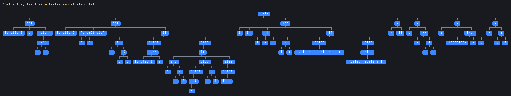
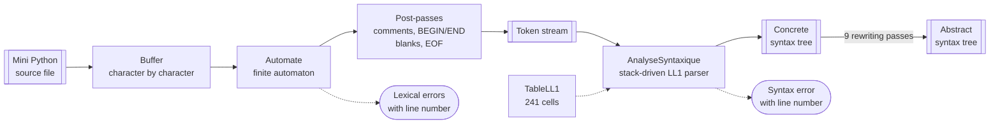
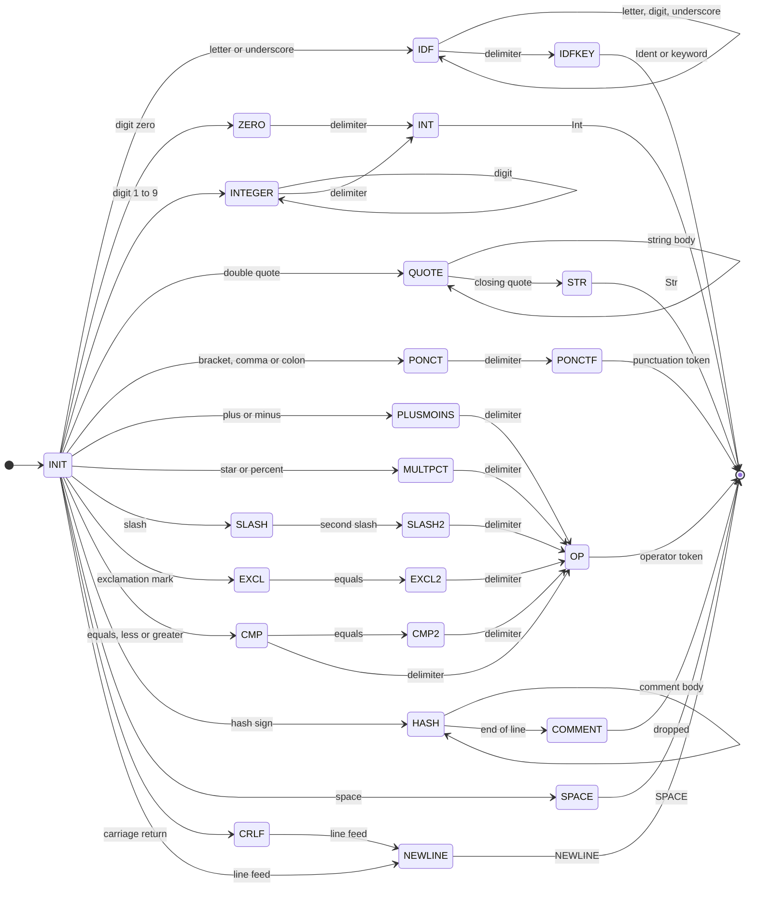
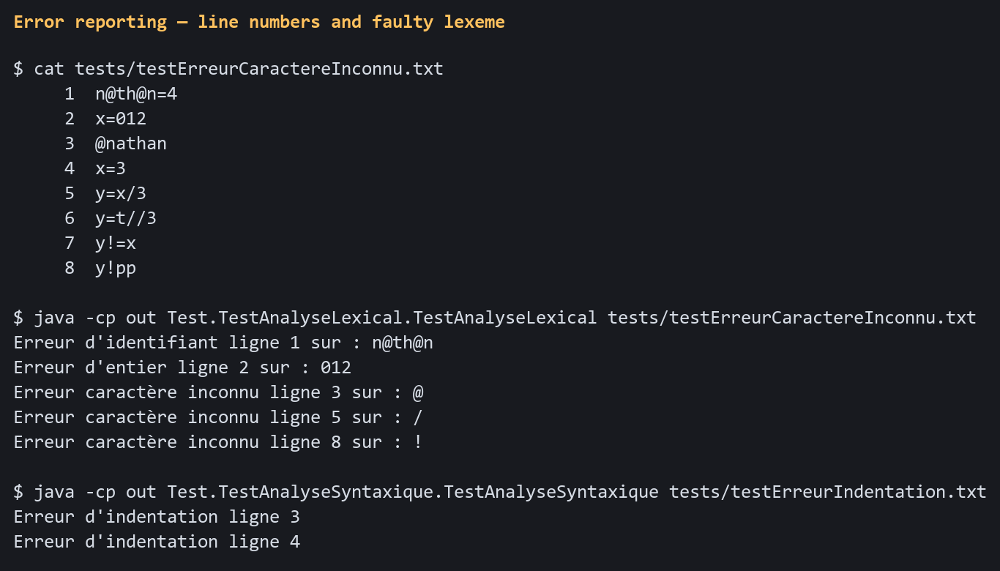
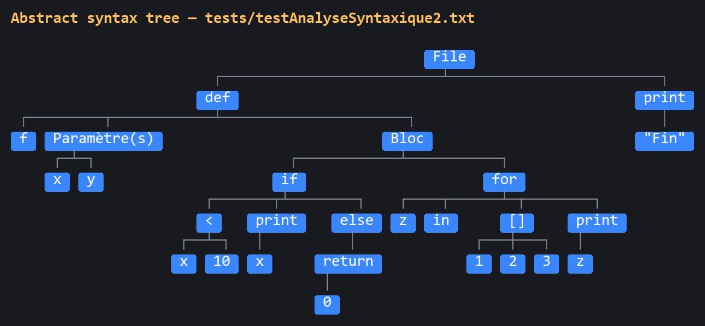
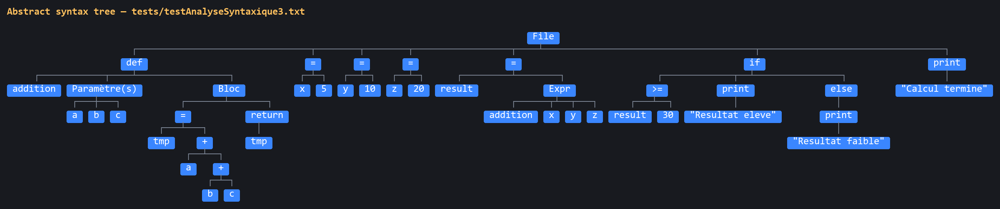

# Mini Python Compiler — front end

A compiler front end for **Mini Python**, a subset of Python, written in plain
Java with **no lexer or parser generator**: the finite automaton and the LL(1)
parser are both hand-written.

It takes a Mini Python source file and produces, in order, a token stream, a
concrete syntax tree and an abstract syntax tree, reporting lexical and
syntactic errors with line numbers along the way.



---

## Table of contents

1. [Context](#context)
2. [The Mini Python language](#the-mini-python-language)
3. [Grammar](#grammar)
4. [Compiler pipeline](#compiler-pipeline)
5. [Stage 1 — Lexical analysis](#stage-1--lexical-analysis)
6. [Stage 2 — Syntax analysis](#stage-2--syntax-analysis)
7. [Stage 3 — Abstract syntax tree](#stage-3--abstract-syntax-tree)
8. [Repository layout](#repository-layout)
9. [Build and run](#build-and-run)
10. [Test programs](#test-programs)
11. [Results](#results)
12. [Third-party code](#third-party-code)

---

## Context

This is the **PCL1** module of the compiler project at TELECOM Nancy
(2nd year, 2024–2025). The brief defines Mini Python — a fragment of Python —
and asks for the front end of a compiler for it:

* a complete definition of the language grammar,
* a **lexical analyser** reading the source file one character at a time,
* a **descending syntax analyser**,
* the construction and visualisation of the **abstract syntax tree**,
* explicit error messages carrying a line number.

The brief explicitly forbids lexer and parser generators, so everything here is
written by hand. Semantic analysis and ARM code generation belong to the follow-up
module (PCL2) and are **not** part of this repository.

Mini Python is derived from the compiler project of the École polytechnique
(2023/2024).

---

## The Mini Python language

### Lexical conventions

| Element | Definition |
| --- | --- |
| Comment | `#` to the end of the line |
| Identifier | `(alpha \| _) (alpha \| _ \| digit)*` |
| Integer | `0` or `1-9 digit*` — a leading zero such as `012` is an error |
| String | Between `"`, with the escapes `\"` and `\n` |
| Keywords | `and` `def` `else` `for` `if` `True` `False` `in` `not` `or` `print` `return` `None` |
| Blocks | By indentation, in spaces; no tab characters |

Indentation is turned into explicit tokens by the lexer, which emits
`NEWLINE`, `BEGIN` and `END` — the usual approach for an indentation-sensitive
language, and the one the brief prescribes:

> The lexer keeps a stack of indentation levels, initially `{0}`. On each new
> line it measures the indentation `n` and compares it with the top of the stack
> `m`: if `n = m` nothing happens; if `n > m` it pushes `n` and emits `BEGIN`;
> if `n < m` it pops until it finds `n`, emitting one `END` per popped level. If
> no popped value equals `n`, it reports an indentation error.

### Operator precedence

From weakest to strongest, as specified by the brief:

| Operators | Associativity |
| --- | --- |
| `or` | left |
| `and` | left |
| `not` | — |
| `<` `<=` `>` `>=` `==` `!=` | — |
| `+` `-` | left |
| `*` `//` `%` | left |
| `-` (unary) | — |
| `[` (indexing) | — |

Note that `x < y < z` is deliberately **not** allowed by the syntax.

---

## Grammar

### Reference grammar (from the brief)

```ebnf
file        ::= NEWLINE? def* stmt+ EOF
def         ::= "def" ident "(" ident*, ")" ":" suite
suite       ::= simple_stmt NEWLINE
              | NEWLINE BEGIN stmt+ END
simple_stmt ::= "return" expr
              | ident "=" expr
              | expr "[" expr "]" "=" expr
              | "print" "(" expr ")"
              | expr
stmt        ::= simple_stmt NEWLINE
              | "if" expr ":" suite
              | "if" expr ":" suite "else" ":" suite
              | "for" ident "in" expr ":" suite
expr        ::= const
              | ident
              | expr "[" expr "]"
              | "-" expr
              | "not" expr
              | expr binop expr
              | ident "(" expr*, ")"
              | "[" expr*, "]"
              | "(" expr ")"
binop       ::= "+" | "-" | "*" | "//" | "%" | "<=" | ">=" | ">" | "<" | "!=" | "=="
              | "and" | "or"
const       ::= integer | string | "True" | "False" | "None"
```

### LL(1) grammar actually implemented

The reference grammar above is ambiguous and left-recursive, so it cannot drive a
predictive parser as-is. Turning it into an **LL(1)** grammar — removing left
recursion, factoring common prefixes, and splitting `expr` into the chain
`expr_init → expr → expr_prime → expr_droite` — was the hardest part of the
project.

The result is **66 productions over 22 non-terminals and 39 terminals**. It
lives in [`docs/grammar-ll1.txt`](docs/grammar-ll1.txt) and is encoded, rule by
rule, in [`src/Grammaire/Regle.java`](src/Grammaire/Regle.java).

```ebnf
file             -> NEWLINE def_etoile stmt stmt_etoile EOF .
file             -> def_etoile stmt stmt_etoile EOF .

def_etoile       -> def def_etoile .
def_etoile       -> .

stmt_etoile      -> stmt stmt_etoile .
stmt_etoile      -> .

def              -> Def ident "(" arg ")" ":" suite .

arg              -> ident next_arg .
arg              -> .
next_arg         -> "," ident next_arg .
next_arg         -> .

suite            -> simple_stmt NEWLINE .
suite            -> NEWLINE BEGIN stmt stmt_etoile END .

stmt             -> simple_stmt NEWLINE .
stmt             -> if expr_init ":" suite Else .
stmt             -> for ident in expr ":" suite .

Else             -> else ":" suite .
Else             -> .

simple_stmt      -> return expr .
simple_stmt      -> print expr .
simple_stmt      -> expr_stmt affect .

affect           -> .
affect           -> "=" expr_init .

expr_init        -> expr expr_droite .

expr_stmt        -> ident ident_fact .
expr_stmt        -> "-" expr_init "[" expr_init "]" .
expr_stmt        -> const "[" expr_init "]" .
expr_stmt        -> not expr_init "[" expr_init "]" .
expr_stmt        -> "[" expr_etoile_init "]" "[" expr_init "]" .
expr_stmt        -> "(" expr_init ")" "[" expr_init "]" .

ident_fact       -> .
ident_fact       -> binop expr expr_prime .
ident_fact       -> "(" expr_etoile_init ")" expr_prime .

ident_expr       -> .
ident_expr       -> "(" expr_etoile_init ")" .

expr_droite      -> expr_prime expr_droite .
expr_droite      -> .

expr             -> const .
expr             -> ident ident_expr .
expr             -> "-" expr .
expr             -> not expr .
expr             -> "[" expr_etoile_init "]" .
expr             -> "(" expr_init ")" .

expr_prime       -> binop expr .

expr_etoile_init -> .
expr_etoile_init -> expr expr_etoile .
expr_etoile      -> "," expr expr_etoile .
expr_etoile      -> .

binop            -> "+" | "-" | "*" | "/" "/" | "%" | "<" | ">=" | ">" | "<="
                  | "!=" | "==" | or | and .

const            -> integer | string | True | False | None .
```

---

## Compiler pipeline



The three stages map onto the classic front end: **lexical analysis** produces
tokens, **syntax analysis** verifies that the token stream belongs to the
language and records the derivation, and a **tree-rewriting stage** turns the
derivation into an abstract syntax tree.

---

## Stage 1 — Lexical analysis

The lexer is a hand-written finite automaton implemented with the **State
pattern**: every state is a class, and each state knows its own successors.

* `EtatIntermediaire` — the lexeme is still being read; `action(c, automate)`
  chooses the next state for the character just consumed.
* `EtatFinaux` — the lexeme is complete; `creationToken()` builds the `Token`
  from the buffered characters and the automaton resets to its initial state.
* `EtatErreur` — the lexeme is malformed; the state consumes the rest of the
  faulty text, emits an error token, and the scan carries on so further errors
  can be reported.

There are **47 state classes** in total. The diagram below shows the recognition
paths; the error states hanging off each path are omitted for readability.



The state names above map onto the classes as follows:

| Diagram | Class | Kind |
| --- | --- | --- |
| `INIT` | `EtatInitial` | intermediate |
| `IDF` → `IDFKEY` | `EtatIdentifiant` → `EtatFinauxIdfKey` | identifier or keyword |
| `ZERO`, `INTEGER` → `INT` | `EtatZero`, `EtatInteger` → `EtatFinauxInt` | integer |
| `QUOTE` → `STR` | `EtatGuillemet` → `EtatFinauxStr` | string |
| `PONCT` → `PONCTF` | `EtatPonctuation0..5` → `EtatFinauxPonctuation` | punctuation |
| `PLUSMOINS`, `MULTPCT`, `SLASH`/`SLASH2`, `EXCL`/`EXCL2`, `CMP`/`CMP2` → `OP` | `EtatPlusMoins`, `EtatMultPourcent`, `EtatSlash`/`EtatSlash2`, `EtatPointExclamation`/`2`, `EtatInegalEgal`/`2` → `EtatFinauxOperateur` | operator |
| `HASH` → `COMMENT` | `EtatHashtag` → `EtatFinauxCommentaire` | comment |
| `SPACE`, `CRLF`, `NEWLINE` | `EtatFinauxEspace`, `EtatWindows`, `EtatFinauxNouvelleLigne` | layout |

A *delimiter* is any character that may legally follow the lexeme being read —
the `isValideApresX` predicates in `Outils`. A character that may **not** follow
it sends the automaton into the matching `EtatErreur` state instead.

Once the whole file has been consumed, a fixed sequence of post-passes turns the
raw stream into what the parser expects:

1. drop comment tokens,
2. insert the `BEGIN` / `END` indentation tokens (and report indentation errors),
3. report lexical errors,
4. drop the spaces sitting on blank lines,
5. drop the remaining spaces,
6. collapse redundant newlines,
7. append `EOF`.

### Errors detected

The lexer distinguishes **ten** error categories, each with its own message, line
number and faulty lexeme: unknown character, malformed identifier, malformed
integer, unterminated string, malformed `//`, malformed `!=`, malformed
comparison or assignment, malformed operator, malformed punctuation, and
indentation error.



---

## Stage 2 — Syntax analysis

The parser is a classic table-driven predictive parser.

**The table.** `TableLL1` stores cells in a map keyed by
`"<non-terminal>:<terminal>"`. It is filled from the productions: a production
goes under every terminal in the FIRST set of its right-hand side, or, when that
side derives ε, under every terminal in the FOLLOW set of its left-hand side.
FIRST and FOLLOW sets are written out by hand on each non-terminal rather than
computed by fixpoint. The resulting table holds **241 cells**.

A handful of cells for the axiom are then written explicitly, because the two
`file` productions — with and without a leading `NEWLINE` — overlap on every
terminal that can start a statement.

**The loop.** Two stacks are run in parallel: one of grammar symbols, which
drives the prediction, and one of tree nodes, which records the derivation.

* a terminal on top of the symbol stack is matched against the look-ahead token;
  on a match both are consumed,
* ε is popped without consuming input,
* a non-terminal is replaced by the right-hand side of the production found in
  the table, pushed in reverse so the leftmost symbol ends up on top,
* an empty cell is a syntax error: the parser reports the line, the offending
  token, the `(non-terminal, terminal)` pair that had no entry, and the last
  production it applied.

---

## Stage 3 — Abstract syntax tree

The tree the parser builds mirrors the derivation, so it is far too verbose to be
useful: it contains every punctuation token and every intermediate non-terminal
introduced to make the grammar LL(1). `Node.treeToAbstractTree()` rewrites it, in
place, through **nine passes**:

| # | Pass | Effect |
| --- | --- | --- |
| 1 | `removeNodesInutiles` | drops syntax noise: brackets, parentheses, commas, colons, `NEWLINE`, `BEGIN`, `END`, `EOF`, ε |
| 2 | `removeNonTerminalWithoutChild` | drops non-terminals left with no child |
| 3 | `replaceNonTerminalWithUniqueTerminalChild` | a non-terminal with a single terminal child becomes that terminal |
| 4 | `mergeNonTerminalWithSingleChild` | collapses chain productions |
| 5 | `remonterFils` | lifts `print`, `return`, `if`, `else`, `def`, `for`, `not` into their parent, so the keyword labels the construct |
| 6 | `remonterOperateur` | lifts a binary operator above its operands |
| 7 | `remonterEgal` | same treatment for `=` |
| 8 | `remonterEtoile` | flattens the repetition non-terminals, turning right-leaning combs into flat sibling lists |
| 9 | `rename` | cosmetic relabelling: every expression non-terminal prints as `Expr`, `Arg` as `Paramètre(s)`, `Suite` as `Bloc`, and the iterated collection of a `for` as `[]` |

Passes 6 and 7 are what turn the right-recursive expression chain required by
LL(1) back into the operator tree you would expect.

---

## Repository layout

```
.
├── src/
│   ├── Outils/              Buffer (character-level file access), predicates,
│   │                        pooled-symbol lookup
│   ├── Automate/            wiring of the lexer automaton
│   ├── Etat/                47 automaton states
│   │   ├── EtatIntermediaire/   states mid-lexeme
│   │   ├── EtatFinaux/          accepting states, build the tokens
│   │   └── EtatErreur/          error states, consume the faulty lexeme
│   ├── Token/               39 terminals + the error tokens
│   ├── AnalyseLexicale/     drives the automaton, runs the post-passes
│   ├── NonTerminal/         22 non-terminals with their FIRST / FOLLOW sets
│   ├── Grammaire/           Symbole, Regle (the 66 productions), Grammaire
│   ├── AnalyseSyntaxique/   TableLL1 and the LL(1) parser
│   ├── Arbre/               Node (+ the 9 AST passes) and the tree printer
│   └── Test/                entry points
├── tests/                   16 Mini Python test programs
├── docs/
│   ├── grammar-ll1.txt      the LL(1) grammar
│   └── img/                 screenshots used in this README
├── build.sh / build.ps1     compilation
└── THIRD-PARTY-NOTICES.md
```

---

## Build and run

### Requirements

A **JDK 17 or later** (developed and tested on JDK 21). Nothing else — no
dependencies, no build tool.

### Compile

```bash
./build.sh          # Linux, macOS, Git Bash
.\build.ps1         # Windows PowerShell
```

or directly:

```bash
mkdir -p out && find src -name '*.java' > sources.txt
javac -encoding UTF-8 -d out @sources.txt
```

### Run the full pipeline

```bash
java -cp out Test.TestAnalyseSyntaxique.TestAnalyseSyntaxique tests/demonstration.txt
```

This prints the token stream, the concrete syntax tree and the abstract syntax
tree. With no argument it falls back to `tests/demonstration.txt`.

### Run the lexer only

```bash
java -cp out Test.TestAnalyseLexical.TestAnalyseLexical tests/testErreurCaractereInconnu.txt
```

This echoes the file character by character, then dumps the tokens by lexeme and
by class.

### Other entry points

```bash
# FIRST and FOLLOW sets of every non-terminal, and the 66 productions
java -cp out Grammaire.TestPremierSuivantRegle

# A hand-built reference tree, to check the printer on its own
java -cp out Test.TestArbre.TestArbre
```

> **Encoding.** The trees are drawn with box-drawing characters and the messages
> are in French. On a console that is not UTF-8 — the Windows default — add
> `-Dstdout.encoding=UTF-8`, or run `chcp 65001` first.

> **One file per run.** The pipeline keeps its state in static fields, so a
> single source file can be analysed per JVM run.

---

## Test programs

The 16 programs in [`tests/`](tests/) are small and are committed in full — they
are the project's test data, not a heavy dataset.

| File | Purpose |
| --- | --- |
| `demonstration.txt` | The showcase program: two functions, nested `if`/`else`, a `for` over a list, arithmetic, comments |
| `testAnalyseSyntaxique1.txt` | Assignments, `if`/`else`, `print`, integer division |
| `testAnalyseSyntaxique2.txt` | Function with two parameters, `if`/`else`, `return`, `for` |
| `testAnalyseSyntaxique3.txt` | Three-parameter function, call with arguments, comparison |
| `testErreurCaractereInconnu.txt` | Unknown characters, malformed identifiers and integers |
| `testErreurIdf.txt` | Identifiers starting with a digit or containing `@` |
| `testErreurInt.txt` | Leading zeros, digits glued to letters |
| `testErreurGuillemet.txt` | Unterminated string |
| `testErreurDivision.txt` | Malformed `//` |
| `testErreurNot.txt` | Malformed `!=` |
| `testErreurInegalEgal.txt` | Malformed comparisons and assignments |
| `testErreurOperateur.txt` | Malformed operators (`%%`) |
| `testErreurPonctuation.txt` | Unbalanced and misplaced brackets |
| `testErreurIndentation.txt` | Indentation not matching any level on the stack |
| `AnalyseSyntaxique2.txt`, `testAnalyseLexical1.txt` | Empty files (edge case) |

---

## Results

Running the full pipeline over the whole test directory:

| Test file | Lexical errors | Syntax errors | AST produced |
| --- | ---: | ---: | :---: |
| `demonstration.txt` | 0 | 0 | ✅ |
| `testAnalyseSyntaxique1.txt` | 0 | 0 | ✅ |
| `testAnalyseSyntaxique2.txt` | 0 | 0 | ✅ |
| `testAnalyseSyntaxique3.txt` | 0 | 0 | ✅ |
| `testErreurCaractereInconnu.txt` | 5 | — | — |
| `testErreurPonctuation.txt` | 3 | — | — |
| `testErreurDivision.txt` | 2 | — | — |
| `testErreurIdf.txt` | 2 | — | — |
| `testErreurIndentation.txt` | 2 | — | — |
| `testErreurInegalEgal.txt` | 2 | — | — |
| `testErreurInt.txt` | 2 | — | — |
| `testErreurNot.txt` | 1 | — | — |
| `testErreurOperateur.txt` | 1 | — | — |
| `testErreurGuillemet.txt` | 1 | — | — |
| `AnalyseSyntaxique2.txt` (empty) | 0 | 1 | — |
| `testAnalyseLexical1.txt` (empty) | 0 | 1 | — |

**Every valid program is accepted and yields a correct abstract syntax tree, and
every invalid one is rejected with a located message.** A file carrying a
lexical error does not reach the parser, which is why its syntax column is empty.

### Abstract syntax trees

`tests/demonstration.txt` — two function definitions, a nested `if`/`else`, a
`for` loop over a list, and four assignments:


`tests/testAnalyseSyntaxique2.txt` — a function with a conditional and a loop,
then a top-level `print`. Note how `Bloc` marks the body of a construct and `[]`
the collection iterated by the `for`:



`tests/testAnalyseSyntaxique3.txt` — a three-parameter function, a call with
arguments, and a conditional on its result:



In every tree, operators sit above their operands, keywords label the construct
they introduce, and the punctuation needed by the grammar is gone.

---

## Third-party code

`src/Arbre/PrettyPrintTree.java` is vendored from
[PrettyPrintTreeJava](https://github.com/AharonSambol/PrettyPrintTreeJava)
by Aharon Sambol, under the MIT license. It draws the trees shown above. See
[THIRD-PARTY-NOTICES.md](THIRD-PARTY-NOTICES.md).

Everything else is original coursework.
